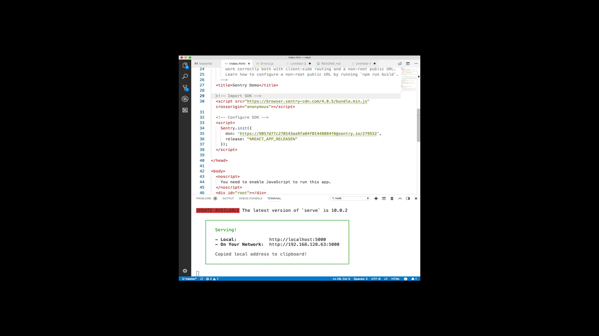

# sentry-demos/react

## Goal/Summary:
Show how Sentry works
- Import/Integrate
- Configuration
- Releases/SourceMaps

## First-time Setup
1. Install dependencies
```
npm install -g serve
npm install -g @sentry/cli
npm install
```

<<<<<<< HEAD
2. Configure Sentry with your `PUBLIC_DSN_KEY` in index.html
3. Remember to include your `SENTRY_AUTH_TOKEN`; you'll need to generate one
first from your Sentry server. After doing so, a cheap and easy way to use the
token would be this: `export SENTRY_AUTH_TOKEN=1010101011010101`
=======
2. Configure Raven with your `PUBLIC_DSN_KEY` in index.html
3. Configure SENTRY_AUTH_TOKEN environment variable. (e.g. `export SENTRY_AUTH_TOKEN=1010101011010101`). See https://docs.sentry.io/api/auth/ for more information
>>>>>>> 1b26b4cc2f4b6c4eeb50af671684adfb74f624d7
4. Make sure that your Github repo is integrated into your Sentry organization.
5. Enter your Sentry organization slug in the `SENTRY_ORG` line of your Makefile,
then add the name of `SENTRY_PROJECT`

```
$ npm run deploy
```
6. Go to http://localhost:5000 in your browser and begin throwing errors/events to Sentry!


